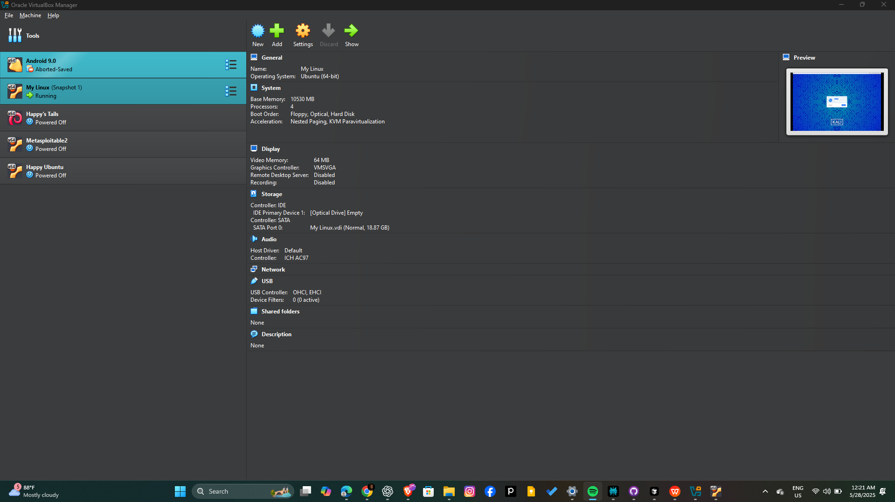

# Day 1: Reinstalling Kali Linux and Learning Basic Linux Commands

Hey, welcome to Day 1 of my 100 Days in Cybersecurity journey. Honestly, this day felt like a fresh start — a reset button for me. I had to reinstall Kali Linux, and while that might sound simple, it was really about reconnecting with the basics, grounding myself before diving deeper.

---

## Why Kali? Why Linux?

Kali is my toolbox. Without it, the journey just doesn’t start right. But more than just tools, Linux is like the heartbeat of cybersecurity. If I don’t know how to navigate this world smoothly, nothing else will follow. So today wasn’t just about installing an OS; it was about learning to *speak* the language that powers so much of what we do.

---

## Installing Kali Linux: Two Ways to Start

Before we dive into the reinstall and the Linux commands, here’s something important I learned: there are really two main ways you can get Kali up and running — and each has its own vibe and purpose.

### 1. Desktop Installation (Partitioning)

This means installing Kali directly on your physical machine. It’s like giving your computer a fresh new identity dedicated to Kali. You’ll have to:

- Partition your hard drive (this means dividing your storage so Kali can live alongside or replace your current OS)
- Follow the installer’s guided steps to get Kali fully set up  
- It’s powerful because you get full access to your hardware, but it’s also more permanent and a bit riskier if you’re not careful with partitioning

This method is for those ready to commit their machine fully or dual-boot Kali with another OS.

### 2. Virtualization

If you’re like me, who wants flexibility and safety, virtualization is a lifesaver. This means running Kali inside another operating system like Windows or macOS using a virtual machine (VM). It’s like having Kali in a bubble — powerful but contained.

Some popular virtualization platforms are:

- **Oracle VirtualBox** (free and open-source)  
- **VMware Workstation Player** (free for personal use)  
- **Parallels** (mostly for Mac users)  

With virtualization, you download Kali’s ISO file or pre-built VM image, create a new VM in your virtualization software, allocate some resources (CPU, RAM, disk space), and boot Kali inside that VM.

Why this matters: You don’t have to mess with your main OS or disk partitions. You can pause, snapshot, and rollback your Kali VM if something goes wrong. Plus, it’s great for learning and experimentation.

---

## Step 1: Download and Reinstall Kali Linux

For today, I went the **desktop installation** route to get a clean slate, but virtualization is just as valid and safer if you’re new.

Here’s how I did it:

1. **Download Kali Linux ISO:**  
   Head to the official Kali site — no shortcuts, no shady links. The link is [https://www.kali.org/get-kali/](https://www.kali.org/get-kali/) — make sure you pick the right version (64-bit for most machines).

2. **Create a Bootable USB:**  
   I used **Rufus** on Windows to burn the Kali ISO onto a USB stick. It’s free and easy. Remember, this erases everything on your USB — so back up first!

3. **Install Kali:**  
   Reboot your PC, boot from the USB, and follow the guided install steps. Pay close attention to disk partitioning and network setup — mistakes here can cost you data if you’re not careful.

4. **Celebrate:**  
   Once installed, I logged in and saw the Kali desktop for the first time. Felt like opening a door to a new world.

If virtualization is your route, here’s a quick overview:

- Download and install Oracle VirtualBox from [https://www.virtualbox.org/](https://www.virtualbox.org/)
- Download Kali Linux VM image or ISO from the Kali site
- Create a new VM in VirtualBox, assign CPU, RAM (at least 2GB), and disk space
- Start the VM and follow Kali’s installation or use the VM image directly
- You now have Kali running safely inside your current OS

---

## Step 2: Basic Linux Commands — My First Lessons

Linux feels intimidating if you’re new, but trust me, it’s just another language — one you can learn word by word. Here’s what I focused on:

- `pwd` — Shows where you are. Think of it as your GPS telling you your location in the file system.  
- `ls` — Lists files and folders. Like looking around a room to see what’s there.  
- `cd` — Changes your directory. It’s how you move through the filesystem maze.



- `mkdir` — Makes a new directory, your way to organize things.  
- `rm` — Removes files. Be careful with this one!  
- `touch` — Creates a new, empty file.  
- `cat` — Reads the contents of a file.

I spent a good hour just moving around, creating, and deleting folders and files — making mistakes, sometimes accidentally deleting things, but learning fast.

---

## Step 3: My Practice Challenge for You

Open your terminal and try this:

```bash
pwd
ls
mkdir test-folder
cd test-folder
touch file1.txt
ls
cat file1.txt
cd ..
rm -r test-folder
ls
````

## Resources That Helped Me Get Here

I won’t leave you hanging. If you need more relatable info suited for your learning style, no worries, Check out my recommendations:

- **The Cyber Mentor (YouTube):** Amazing for Kali Linux and beginner-friendly cybersecurity content.  
  [https://www.youtube.com/c/TheCyberMentor](https://www.youtube.com/c/TheCyberMentor)

- **Linux Journey:** Free and clean guide to learning Linux basics step by step.  
  [https://linuxjourney.com/](https://linuxjourney.com/)

- **NetworkChuck (YouTube):** Great for practical Linux and cybersecurity tutorials.  
  [https://www.youtube.com/c/NetworkChuck](https://www.youtube.com/c/NetworkChuck)
